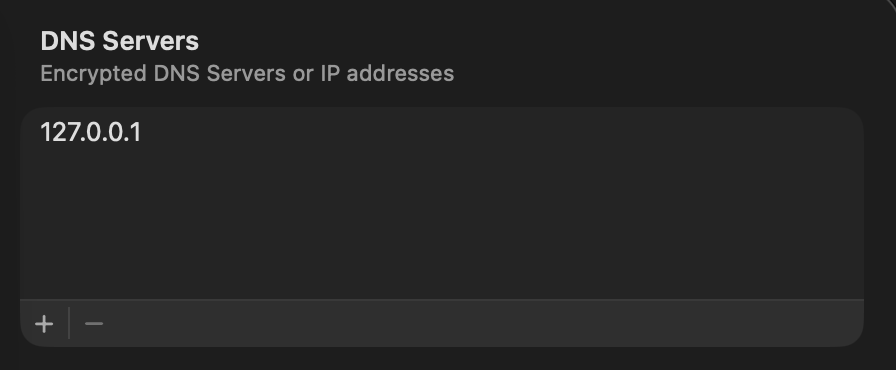

# sptth

All-in-one tool for local server development with **valid HTTPS**.

## Concept

Do you usually develop with URLs like `http://localhost:3000`?
`localhost` is a special hostname and behaves differently from production, so things that work locally can fail after deployment on `https://${your-production-domain}`.

`sptth` bundles everything needed to develop locally on real domains such as `https://${your-production-domain}`.

- Local DNS
- Local CA
- Local reverse proxy

You can start all of them with one `sudo` command and test locally in conditions closer to production.

## Caution

> [!CAUTION]
> `sptth` is in **Early Preview** during `v0.x`.
> It changes some of your local settings.
> Use it at your own risk.

## Quick Start

Change your OS DNS server to `127.0.0.1`.

### macOS

`System Settings > Network > Wi-Fi Details > DNS > DNS Servers`



### Windows

Open `Control Panel > Network and Internet > Network Connections`, open your active network adapter, then set DNS server `127.0.0.1` in `Internet Protocol Version 4 (TCP/IPv4)`.

### Ubuntu

Set DNS manually to `127.0.0.1` in `Settings > Network`, or configure `/etc/resolv.conf` / `systemd-resolved` to use `127.0.0.1`.

## Install

TODO: add binary release installation steps.

## Development Setup

After cloning, run setup once to install local development tools into `.tools/`.

```sh
cargo run -p xtask -- setup
```

Formatting commands:

```sh
cargo run -p xtask -- fmt
cargo run -p xtask -- fmt-check
```

`xtask setup` installs pinned versions of:

- `dprint` binary
- Markdown plugin
- TOML plugin
- JSON plugin

Artifacts are stored in `.tools/` and are not committed to git.

`xtask setup` also enables repository hooks via `core.hooksPath=.githooks`.
The `pre-commit` hook auto-formats and re-stages `*.rs`, `*.json`, `*.md`, and `*.toml`.

## Run

```sh
sudo sptth config.toml
```

It requires installing a local CA into the OS trust store. Please accept it (at your own risk).

## `config.toml`

```toml
[dns]
listen = "127.0.0.1:53"
upstream = ["1.1.1.1:53", "8.8.8.8:53"]

[[record]]
domain = "example.com"
A = ["127.0.0.1"]
AAAA = ["::1"]

[[record]]
domain = "example.net"
A = ["127.0.0.1"]
AAAA = ["::1"]

[tls]
ca_dir = "~/.config/sptth/ca"
cert_dir = "~/.config/sptth/certs"

[[proxy]]
domain = "example.com"
listen = "127.0.0.1:443"
upstream = "localhost:3000"

[[proxy]]
domain = "example.net"
listen = "127.0.0.1:443"
upstream = "localhost:4000"
```

In this example, access to these domains is proxied to local servers.

- `https://example.com` -> `http://localhost:3000`
- `https://example.net` -> `http://localhost:4000`

This works because the local DNS resolves `example.com` and `example.net` to `127.0.0.1`, and the proxy forwards HTTPS on port 443 to the upstream HTTP servers.

The browser should not show certificate errors, because valid TLS certificates are issued by a local CA trusted by the OS.

## Current Platform Support

- macOS: supported
- Linux: supported (`update-ca-certificates` or `update-ca-trust`)
- Windows: supported (`certutil`)

## Options

### Top-level options

- `log_level`
  - Application-wide log level (default: `info`, values: `error` | `info` | `debug`)

### `[dns]` section

```toml
[dns]
listen = "127.0.0.1:53"
upstream = ["1.1.1.1:53", "8.8.8.8:53"]

[[record]]
domain = "example.com"
A = ["127.0.0.1"]
AAAA = ["::1"]
```

This starts a DNS server on `127.0.0.1:53`.
Queries for domains in `[[record]]` return local `A`/`AAAA` values; all others are forwarded to upstream DNS.

- `[dns].listen`
  - DNS listen IP/port
- `[dns].upstream`
  - Upstream DNS servers
- `[dns].ttl_seconds`
  - Record TTL (default: `1`)

### `[tls]` section

```toml
[tls]
ca_dir = "~/.config/sptth/ca"
cert_dir = "~/.config/sptth/certs"
```

The `[tls]` section is required in the config file.

`sptth` creates a local CA and installs it into the OS trust store.
On first run, the generated CA certificate and key are saved in `ca_dir`.
If files already exist in `ca_dir`, they are reused and trust-store modification is skipped.

At startup, certificates for all domains in `[[proxy]]` are generated and signed by the local CA.
Files are stored in `cert_dir` and used by the proxy to provide valid TLS in browsers.

- `[tls].ca_common_name`
  - Root CA common name (default: `sptth local ca`)
- `[tls].valid_days`
  - Server certificate validity in days (default: `90`)
- `[tls].renew_before_days`
  - Renewal threshold before expiry in days (default: `30`)
- `[tls].ca_dir`
  - Root CA certificate/key directory (default: `~/.config/sptth/ca`)
- `[tls].cert_dir`
  - Domain certificate/key directory (default: `~/.config/sptth/certs`)

(When running with `sudo`, default `tls.ca_dir` / `tls.cert_dir` are resolved under the `SUDO_USER` home directory.)

> [!WARNING]
>
> - Startup fails if trust-store installation fails.
> - Linux requires either `update-ca-certificates` or `update-ca-trust`.
> - Windows requires `certutil`.

### `[[proxy]]` section

```toml
[[proxy]]
domain = "example.com"
listen = "127.0.0.1:443"
upstream = "localhost:3000"
```

This forwards `https://example.com` to `http://localhost:3000`.

- `[[proxy]].domain`
  - Routing domain (must be unique)
- `[[proxy]].listen`
  - Proxy listen address; all entries must share the same value in the current version
- `[[proxy]].upstream`
  - Upstream in `host:port` format

## Build and Run from Source

```sh
git clone https://github.com/jxck/sptth.git
cd sptth
cargo run -p xtask -- setup
cargo build --release
sudo ./target/release/sptth config.toml
```

## Verification

Start a local upstream server first:

```sh
echo "<title>hello</title>" > index.html
python3 -m http.server 3000
```

Verify DNS resolution (with OS DNS set to `127.0.0.1`):

```sh
dig example.com A

;; ANSWER SECTION:
example.com.        1    IN    A    127.0.0.1
```

Verify HTTPS proxy:

```sh
curl https://example.com/
<title>hello</title>
```

## ACK

All source code was written in Rust by Codex.
